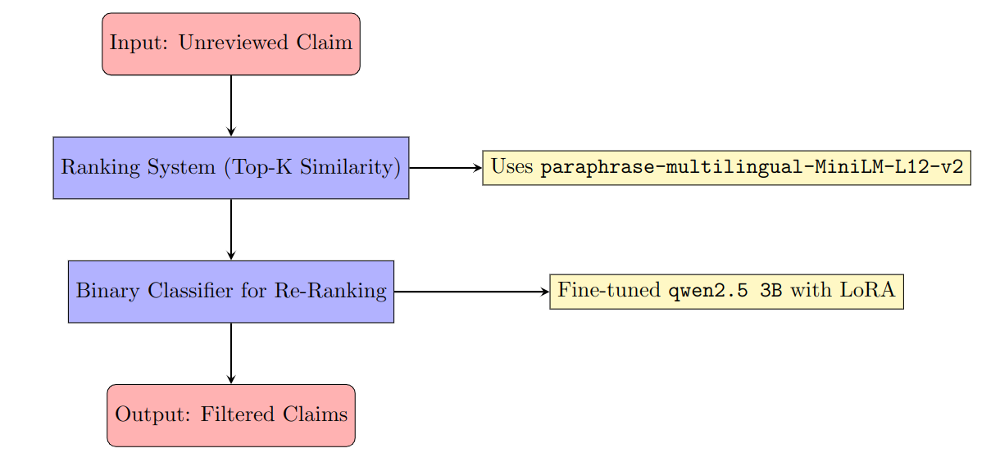
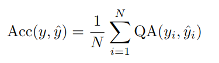
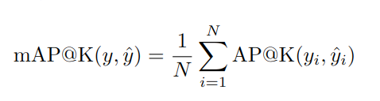
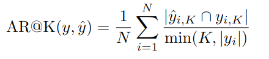
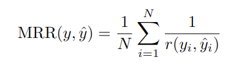
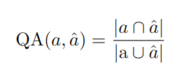

# Claim Classification and Ranking System

This repository contains a pipeline for processing unreviewed claims, ranking them based on similarity to reviewed claims, and classifying their relevance using a binary classifier. The pipeline uses modern NLP techniques and fine-tuned large language models (LLMs).

---

## 📋 Project Overview

The pipeline processes a list of unreviewed claims paired with reviewed claims, which are labeled with `0` (not similar) or `1` (similar). The goal is to identify reviewed claims most relevant to the unreviewed ones.

### Pipeline Steps

1. **Ranking System**:
   - Identifies the top \( K \) reviewed claims most similar to the input unreviewed claim.
   - Uses the transformer model `sentence-transformers/paraphrase-multilingual-MiniLM-L12-v2` to compute similarity scores.

2. **Binary Classifier for Re-Ranking**:
   - Fine-tuned `qwen2.5 3B` LLM with LoRA to classify whether reviewed claims are similar to the unreviewed claim.
   - Filters out irrelevant claims from the top \( K \) list.

3. **Final Selection**:
   - Presents the claims retained by the binary classifier as the final output.

### Visual Representation

Below is the flowchart of the pipeline:



---

## 🧮 Evaluation Metrics

The following metrics are used to evaluate the pipeline:

### 1. **Accuracy**
Calculates the proportion of correct predictions compared to the ground truth:



### 2. **Mean Average Precision at \( K \) (mAP@K)**
Evaluates precision over the top \( K \) predictions:



### 3. **Recall at \( K \)**
Measures the fraction of relevant claims retrieved:



### 4. **Mean Reciprocal Rank (MRR)**
Computes the average reciprocal rank of the first relevant prediction:



### 5. **Query Accuracy**
Shows the query-based evaluation:



---

## 🚀 Getting Started

1. Clone the repository:
   ```bash
   git clone https://github.com/JoseRPrietoF/claim_ranking
   cd claim_ranking
   ```

2. Install dependencies:
   ```bash
   pip install -r requirements.txt
   ```

3. Run the pipeline:
   Execute the provided Jupyter Notebook to train the model and test the pipeline.

4. **Training the System**:
   - In the second cell of the notebook, set the variable `Train` to `True` to train the system.
   - If `Train` is set to `False`, the system will load pre-trained weights from the `results` directory by default.

   > Note: Experiments were conducted using `MiniLM`, a lightweight model, but it did not perform consistently well due to dataset imbalance. While it occasionally achieved good results depending on the random seed, it lacked reproducibility. In contrast, `Qwen2.5` consistently delivered stable and high performance.

---

## 📊 Results

We evaluated the system on 20% of the dataset reserved for testing. Below are the key metrics:

**Metrics Report:**
```
Mean Average Precision (MAP@k):
  MAP@1: 0.8936
  MAP@3: 0.8044
  MAP@5: 0.7837
  MAP@10: 0.7653

Recall@k:
  Recall@1: 0.8936
  Recall@3: 0.8262
  Recall@5: 0.8319
  Recall@10: 0.8155

Mean Reciprocal Rank (MRR):
  MRR: 0.9191

Overall Accuracy:
  Accuracy: 0.64
```

---

## 📂 Repository Structure

- **`data/`**: The directory containing the datasets to load and/or save.
- **`report/`**: Documentation and explanation of the pipeline and metrics in LaTeX.
- **`results_Qwen/`**: The fine-tuned `Qwen2.5` model weights.
- **`classifier_LMM.ipynb`**: The main Jupyter Notebook to execute the pipeline.

---

## 💡 Discussion

- **Experimenting with Other Models:** While `Qwen2.5` performed well, experimenting with larger Qwen models or recently released models like `LLama 3.3` or `phi4` could yield better results.
- **Using More Data:** Attempts were made to include additional metadata and reviewed claim details as input to `Qwen2.5`. However, this significantly increased computation time (as the experiments were run on a laptop) and did not improve results. There is potential for further exploration in this area.
- **Vector Databases:** Tools like LangChain and vector databases such as LanceDB or FAISS could be integrated to create a robust vector-based retrieval system for finding similar documents efficiently.

---

## 🛠️ Technologies Used

- **Transformers** (`sentence-transformers/paraphrase-multilingual-MiniLM-L12-v2`)
- **Fine-tuned LLM** (`qwen2.5 3B` with LoRA)
- **PyTorch**
- **Hugging Face Transformers**

---

## 📧 Contact

For questions or suggestions, feel free to reach out!
