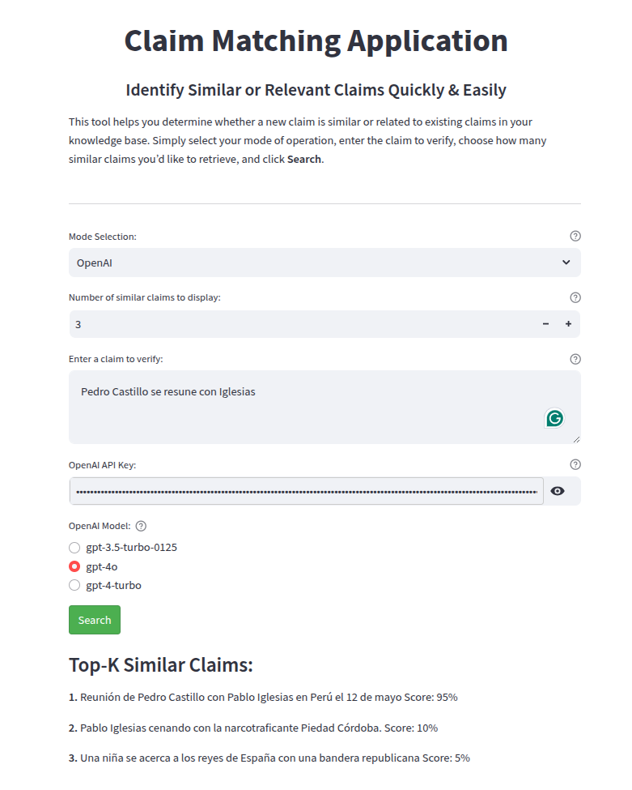

# Claim Classification and Ranking System

This repository contains a pipeline for processing unreviewed claims, ranking them based on similarity to reviewed claims, and classifying their relevance using a binary classifier. The pipeline uses modern NLP techniques and fine-tuned large language models (LLMs).

---

## 📋 Project Overview

The pipeline processes a list of unreviewed claims paired with reviewed claims, which are labeled with `0` (not similar) or `1` (similar). The goal is to identify reviewed claims most relevant to the unreviewed ones.

### Pipeline Steps

1. **Ranking System**:
   - Identifies the top \( K \) reviewed claims most similar to the input unreviewed claim.
   - Uses the transformer model `sentence-transformers/paraphrase-multilingual-MiniLM-L12-v2` to compute similarity scores.

2. **Binary Classifier for Re-Ranking**:
   - Fine-tuned `qwen2.5 3B` LLM with LoRA to classify whether reviewed claims are similar to the unreviewed claim.
   - Filters out irrelevant claims from the top \( K \) list.

3. **Final Selection**:
   - Presents the claims retained by the binary classifier as the final output.

### Visual Representation

Below is the flowchart of the pipeline:


---

## 🧮 Evaluation Metrics

The following metrics are used to evaluate the pipeline:

### 1. **Accuracy**
Calculates the proportion of correct predictions compared to the ground truth:


### 2. **Mean Average Precision at \( K \) (mAP@K)**
Evaluates precision over the top \( K \) predictions:


### 3. **Recall at \( K \)**
Measures the fraction of relevant claims retrieved:


### 4. **Mean Reciprocal Rank (MRR)**
Computes the average reciprocal rank of the first relevant prediction:


### 5. **Query Accuracy**
Shows the query-based evaluation:


---

## 🚀 Getting Started

1. Clone the repository:
   ```bash
   git clone https://github.com/JoseRPrietoF/claim_ranking
   cd claim_ranking
   ```

2. Install dependencies:
   ```bash
   pip install -r requirements.txt
   ```

3. Run the pipeline:
   Execute the provided Jupyter Notebook to train the model and test the pipeline.

4. **Training the System**:
   - In the second cell of the notebook, set the variable `Train` to `True` to train the system.
   - If `Train` is set to `False`, the system will load pre-trained weights from the `results` directory by default.

   > Note: Experiments were conducted using `MiniLM`, a lightweight model, but it did not perform consistently well due to dataset imbalance. While it occasionally achieved good results depending on the random seed, it lacked reproducibility. In contrast, `Qwen2.5` consistently delivered stable and high performance.

---

## 📊 Results

We evaluated the system on 20% of the dataset reserved for testing. Below are the key metrics:

**Metrics Report:**
```
Mean Average Precision (MAP@k):
  MAP@1: 0.8936
  MAP@3: 0.8044
  MAP@5: 0.7837
  MAP@10: 0.7653

Recall@k:
  Recall@1: 0.8936
  Recall@3: 0.8262
  Recall@5: 0.8319
  Recall@10: 0.8155

Mean Reciprocal Rank (MRR):
  MRR: 0.9191

Overall Accuracy:
  Accuracy: 0.64
```

---

## 📂 Repository Structure

- **`data/`**: The directory containing the datasets to load and/or save.
- **`report/`**: Documentation and explanation of the pipeline and metrics in LaTeX.
- **`results_Qwen/`**: The fine-tuned `Qwen2.5` model weights.
- **`classifier_LMM.ipynb`**: The main Jupyter Notebook to execute the pipeline.

---

## 💡 Discussion

- **Experimenting with Other Models:** While `Qwen2.5` performed well, experimenting with larger Qwen models or recently released models like `LLama 3.3` or `phi4` could yield better results.
- **Using More Data:** Attempts were made to include additional metadata and reviewed claim details as input to `Qwen2.5`. However, this significantly increased computation time (as the experiments were run on a laptop) and did not improve results. There is potential for further exploration in this area.
- **Vector Databases:** Tools like LangChain and vector databases such as LanceDB or FAISS could be integrated to create a robust vector-based retrieval system for finding similar documents efficiently.

---

## 🛠️ Technologies Used

- **Transformers** (`sentence-transformers/paraphrase-multilingual-MiniLM-L12-v2`)
- **Fine-tuned LLM** (`qwen2.5 3B` with LoRA)
- **PyTorch**
- **Hugging Face Transformers**

---
---
---

# Claim Classification and Ranking System without notebook, creating an API and using streamlit (Updated)

This repository contains a complete pipeline for processing unreviewed claims, identifying the most relevant reviewed claims, and classifying their similarity using both local and OpenAI-based models. The system integrates a modern architecture, including vector databases, large language models (LLMs), and a user-friendly interface.




---

## 🏛️ Architecture

### Directory Structure
```
app/
  api.py         # FastAPI application for the backend
  interface.py   # Streamlit interface for user interaction

docker/
  api/           # Docker configuration for the API
  docker_streamlit/  # Docker configuration for the Streamlit interface

models/
  model.py       # Local model implementation
  model_openai.py # OpenAI-based model implementation

vector_db/
  db_handler.py  # Handles LanceDB operations
```

### Workflow
1. **API**: Handles the inference logic and serves results via HTTP endpoints.
2. **Streamlit Interface**: Allows users to input claims, select options, and view results interactively.
3. **Vector Database**: LanceDB indexes reviewed claims and retrieves the most similar ones based on cosine similarity.

---

## 🚀 Getting Started

### Prerequisites
Ensure you have Docker installed on your system.

### Steps to Run the System

#### 1. Build the Docker Images
- **API**:
  ```bash
  docker build -t claim-matching-app_api -f docker/api/Dockerfile .
  ```

- **Streamlit Interface**:
  ```bash
  docker build -t claim-matching-app_streamlit -f docker/docker_streamlit/Dockerfile .
  ```

#### 2. Run the Docker Containers
- **API**:
  ```bash
  docker run --network=host --ipc=host -p 8000:8000 claim-matching-app_api
  ```

- **Streamlit Interface**:
  ```bash
  docker run --network=host --ipc=host -p 8501:8501 claim-matching-app_streamlit
  ```

  -  I didn't test the Docker in local mode. First, we need an image from NVIDIA, like `nvidia/cuda:12.1.1-cudnn8-runtime-ubuntu22.04`, and then run the Docker with `--gpus all`. 

#### 3. Access the Interface
Open your browser and navigate to: [http://localhost:8501/](http://localhost:8501/)

---


## 🛠️ Technologies Used
- **Transformers** (`sentence-transformers/paraphrase-multilingual-MiniLM-L12-v2`)
- **Fine-tuned LLM** (`qwen2.5 3B` with LoRA)
- **PyTorch**
- **Hugging Face Transformers**
- **LanceDB** for vector indexing
- **Docker** for deployment
- **Langchain** for OpenAI calls
- **PyDantic and FastAPI** 
- **Streamlit**
  
---

## 💡 Future Work

1. **Enhance Data Utilization**: Currently, only the `reviewed claim` column is used for similarity computation. Future iterations could incorporate additional metadata columns.
2. **Optimize Model Performance**: Experiment with larger models like `LLama 3.3` or `phi4` for improved classification.
3. **Streamline Docker Images**: Separate dependencies to reduce image size and improve build times.

---

## 📧 Contact
For questions or suggestions, feel free to reach out!

